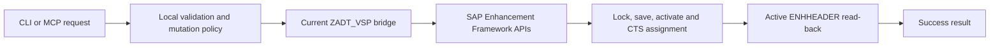

# Creating enhancement implementations

This guide is the canonical reference for creating classic SAP Enhancement
Framework implementations with the Augusto42 VSP distribution. The feature is
available from `v2.40.0-augusto.1`.

Download the published release artifacts and checksums from
[v2.40.0-augusto.1 on GitHub](https://github.com/Augusto42/vibing-steampunk/releases/tag/v2.40.0-augusto.1).

VSP supports three explicit creation contracts:

| Requested kind | SAP tool type | Created object | Current scope |
|---|---|---|---|
| `XH` | `HOOK_IMPL` | Source-code plug-in | One implementation at an exact Enhancement Framework anchor |
| `CLASS` | `CLASENH` | Class enhancement | Empty enhancement or one new instance method |
| `BADI` | `BADI_IMPL` | BAdI implementation | Links one existing implementation class to an existing BAdI definition |

`ENHC` composites and `ENHS` definition/spot creation are not supported. VSP
fails explicitly instead of substituting another repository object type.

## How creation is kept safe



VSP does not report success merely because the background worker accepted a
request. It waits up to 60 seconds for an active `ENHHEADER` entry whose
authoritative `ENHTOOLTYPE` matches the requested kind. If the worker raises an
error, the SAP-side flow attempts to delete the partial enhancement before
returning the failure.

This is intentionally a dedicated `CreateEnhancement` operation. A generic
`WriteSource` call cannot safely infer the host object, injection anchor, class,
enhancement spot, BAdI definition, or implementation relationship from source
text alone.

## Prerequisites

Before creating an enhancement:

1. Install VSP `v2.40.0-augusto.1` or newer.
2. Configure a non-production SAP system with working ADT access.
3. Install or update the ZADT_VSP bridge from the same VSP binary.
4. Confirm that the SAP user may develop in the target namespace/package and,
   for transportable packages, may use the selected CTS request or task.
5. Start with synthetic objects in a sandbox package.

```powershell
vsp --version
vsp -s dev system info
vsp -s dev install zadt-vsp --package '$ZADT_VSP'
vsp -s dev enhancement create --help
```

The CLI binary and the embedded bridge must be kept together. If an older
bridge is installed, VSP returns an explicit update message instead of falling
back to an unsafe creation path.

## Common validation rules

All kinds share these checks before SAP is mutated:

- the ENHO name must not already exist;
- `name`, `description`, and `package` are required;
- descriptions are limited to 60 characters;
- identifiers accept uppercase letters, digits, `_`, `/`, and `$`;
- source payloads are limited to 512 KiB;
- package and transport allowlists are enforced;
- a package that records changes requires an explicit transport;
- the transport selected by SAP must match the caller-approved transport.

Names are normalized to uppercase. Class-enhancement ENHO names are limited to
25 characters for compatibility with classic Enhancement Framework systems.

| Field | Limit |
|---|---:|
| ENHO name (`XH`/`BADI`) | 30 characters |
| ENHO name (`CLASS`) | 25 characters |
| Description | 60 characters |
| XH host/main identifiers | 40 characters each |
| Class, method, spot, BAdI, implementation, and implementation-class identifiers | 30 characters each |
| Anchor and parent anchor | 255 characters each |
| XH source or class-method source | 512 KiB |

## Source-code plug-in (`XH`)

An XH request needs the host object, exact Enhancement Framework `FULL_NAME`
anchor, source body, package, and description. VSP deliberately does not guess
an injection point.

PowerShell example using only synthetic names:

```powershell
@'
DATA lv_sample TYPE string.
lv_sample = 'synthetic'.
'@ | vsp -s dev enhancement create xh ZSAMPLE_XH `
  --host-type PROG `
  --host ZSAMPLE_HOST `
  --anchor '\PR:ZSAMPLE_HOST\SE:END\EI' `
  --package '$TMP' `
  --description 'Synthetic source hook'
```

Bash equivalent:

```bash
vsp -s dev enhancement create xh ZSAMPLE_XH \
  --host-type PROG \
  --host ZSAMPLE_HOST \
  --anchor '\PR:ZSAMPLE_HOST\SE:END\EI' \
  --package '$TMP' \
  --description 'Synthetic source hook' < body.abap
```

Relevant optional flags:

| Flag | Meaning |
|---|---|
| `--program` | Generated/main program; defaults to `--host` |
| `--main-type`, `--main-name` | Main repository object; defaults to the host |
| `--parent-anchor` | Parent `FULL_NAME`, when SAP exposes a nested anchor |
| `--spot` | Existing enhancement spot associated with the plug-in |
| `--enhancement-mode` | `S`, `E`, or `I`; default `S` |
| `--overwrite` | Requests an overwrite element |
| `--hook-method` | Marks the element as a method hook |

The anchor and parent anchor are limited to 255 characters. Copy the exact
anchor from SAP metadata or from an existing discovery result; visually similar
anchors are not interchangeable.

## Class enhancement (`CLASS`)

The host class must already exist. VSP can create an empty class enhancement or
add one new parameterless instance method during creation.

```powershell
@'
DATA lv_sample TYPE string.
lv_sample = 'synthetic'.
'@ | vsp -s dev enhancement create class ZSAMPLE_CLASS_ENH `
  --class ZCL_SAMPLE_HOST `
  --method SAMPLE_METHOD `
  --method-description 'Synthetic enhanced method' `
  --exposure PUBLIC `
  --package '$TMP' `
  --description 'Synthetic class enhancement'
```

The source on stdin may be only the method body or a complete
`METHOD ... ENDMETHOD` block. If no source is supplied for a named method, VSP
creates an empty method body. `--exposure` accepts `PUBLIC`, `PROTECTED`, or
`PRIVATE`.

To create only the class-enhancement container, omit `--method` and stdin:

```powershell
vsp -s dev enhancement create class ZSAMPLE_CLASS_ENH `
  --class ZCL_SAMPLE_HOST `
  --package '$TMP' `
  --description 'Synthetic class enhancement'
```

Current limitation: the creation contract does not yet model method parameters,
exceptions, class methods, multiple methods in one request, attributes, events,
or interface additions.

## BAdI implementation (`BADI`)

The enhancement spot, BAdI definition, and implementation class must already
exist. The class must implement the interface required by the BAdI definition.
VSP creates the ENHO relationship; it never rewrites the class.

```powershell
vsp -s dev enhancement create badi ZSAMPLE_BADI_ENH `
  --spot ZSAMPLE_SPOT `
  --badi ZSAMPLE_BADI `
  --implementation ZSAMPLE_IMPL `
  --implementation-class ZCL_SAMPLE_IMPL `
  --implementation-description 'Synthetic implementation' `
  --package '$TMP' `
  --description 'Synthetic BAdI implementation'
```

Use `--inactive` to create an inactive BAdI implementation entry or `--default`
to mark it as the default implementation. Without `--inactive`, the entry is
created active.

Current limitation: filter values, fallback-class creation, implementation-class
generation, multiple implementations in one request, and BAdI/spot definition
creation are outside this contract.

## Transportable packages

A transportable package requires all three elements below:

1. an explicit package;
2. an explicit CTS request or owned task;
3. authorization through VSP's transportable-edit safety gate.

```powershell
vsp -s dev enhancement create class ZSAMPLE_CLASS_ENH `
  --class ZCL_SAMPLE_HOST `
  --package ZSAMPLE `
  --description 'Synthetic transported enhancement' `
  --transport DEVK900001 `
  --allow-transportable-edits `
  --allowed-packages 'ZSAMPLE' `
  --allowed-transports 'DEVK9*'
```

The same controls can be configured with `SAP_ALLOW_TRANSPORTABLE_EDITS`,
`SAP_ALLOWED_PACKAGES`, and `SAP_ALLOWED_TRANSPORTS`, or in the selected
`.vsp.json` system profile. `--enable-transports` is for transport-management
operations such as creating or releasing requests; it is not a replacement for
`--allow-transportable-edits` on repository writes.

On classic NetWeaver 7.52, older VSP builds could invoke an interactive CTS
selection dialog while an enhancement subobject was being saved by a background
worker. That manifested as `TRINT_ORDER_CHOICE` or
`DYNPRO_SEND_IN_BACKGROUND`. `v2.40.0-augusto.1` propagates the already approved
CTS task through SAP's standard CTS memory contract before saving subobject
texts. Upgrade both the CLI and ZADT_VSP bridge if either symptom appears.

## MCP usage

The same operation is available as the focused-mode `CreateEnhancement` tool.
Parameter names use snake case:

```text
CreateEnhancement(
  kind="CLASS",
  name="ZSAMPLE_CLASS_ENH",
  description="Synthetic class enhancement",
  package="$TMP",
  class_name="ZCL_SAMPLE_HOST",
  method_name="SAMPLE_METHOD",
  method_description="Synthetic enhanced method",
  method_exposure="PUBLIC",
  source="DATA lv_sample TYPE string."
)
```

Kind-specific parameter groups:

- XH: `host_object_type`, `host_object_name`, `host_program`,
  `main_object_type`, `main_object_name`, `anchor`, `parent_anchor`, `spot`,
  `enhancement_mode`, `overwrite`, `hook_method`, and `source`;
- CLASS: `class_name`, `method_name`, `method_description`,
  `method_exposure`, and `source`;
- BADI: `spot`, `badi_name`, `implementation_name`, `implementation_class`,
  `implementation_description`, `inactive`, and `default_implementation`.

Do not send unrelated kind-specific fields. The contract is explicit so an AI
agent cannot silently reinterpret source as a different SAP object.

## Verifying the result

The creation result is JSON. A successful result contains `success: true`, the
normalized ENHO name, package, authoritative tool type, object URL, and a
successful activation result.

Read the object back through the unified source command:

```powershell
vsp -s dev source ENHO ZSAMPLE_XH
vsp -s dev source ENHO ZSAMPLE_CLASS_ENH
vsp -s dev source ENHO ZSAMPLE_BADI_ENH
```

The returned representation depends on the subtype:

- XH: source wrapper and implementation body;
- CLASS: generated declaration include and `EMnnn` method includes;
- BADI: structured spot, definition, implementation name, implementation
  class, activation state, and description.

VSP queries `ENHHEADER.ENHTOOLTYPE` because some older ADT search services
incorrectly label every ENHO result as XH.

## Troubleshooting

| Symptom | Likely cause | Action |
|---|---|---|
| Bridge does not support creation | SAP has an older `ZCL_VSP_RFC_SERVICE` | Run `vsp -s dev install zadt-vsp --package '$ZADT_VSP'` with the current binary |
| Package records changes and requires a transport | Transportable package without explicit CTS request | Pass `--transport` and enable transportable edits |
| Transport is not allowed | Request does not match the configured allowlist | Use the approved request/task or adjust the scoped allowlist |
| SAP selected a different lock owner | Object or subobject is already assigned elsewhere | Resolve the CTS ownership; do not bypass the check |
| Enhancement already exists | Creation is intentionally non-overwriting | Choose a new name or use the supported existing-XH update flow |
| No matching active ENHO appeared within 60 seconds | SAP worker failed, activation is delayed, or read-back is unavailable | Inspect SAP dumps/activation logs and retry only after resolving the cause |
| Unexpected tool type | Repository object does not match the requested kind | Inspect the existing ENHO; VSP intentionally refuses to report success |
| Class or implementation class not found | A required host object is absent | Create/activate the prerequisite object first |
| Invalid XH anchor | Anchor was guessed, truncated, or copied from another include | Discover and pass the exact `FULL_NAME` |
| `TRINT_ORDER_CHOICE` or `DYNPRO_SEND_IN_BACKGROUND` | Old CLI/bridge pair | Upgrade to `v2.40.0-augusto.1` or newer and redeploy the bridge |

## Validation evidence and privacy

The release was validated on 17 August 2026 with synthetic objects only:

| Scenario | Local package | Transportable package |
|---|:---:|:---:|
| XH creation, activation, and source read-back | Passed | Passed |
| Class enhancement plus generated method read-back | Passed | Passed |
| BAdI ENHO plus structured metadata read-back | Passed | Passed |
| CTS ownership verification | Not applicable | Passed |

The classic-system validation used an isolated SAP NetWeaver 7.52 NPL lab. The
repository tests, `go vet`, and GitHub Actions also passed. No customer source,
credentials, endpoints, package names, transport identifiers, dumps, or other
private operational data are part of the fixtures or documentation.

For the complete type matrix, see [ABAP object support](object-support.md). For
the synthetic simulator and validation ladder, see
[Testing VSP without customer SAP data](mock-sap-testing.md).
